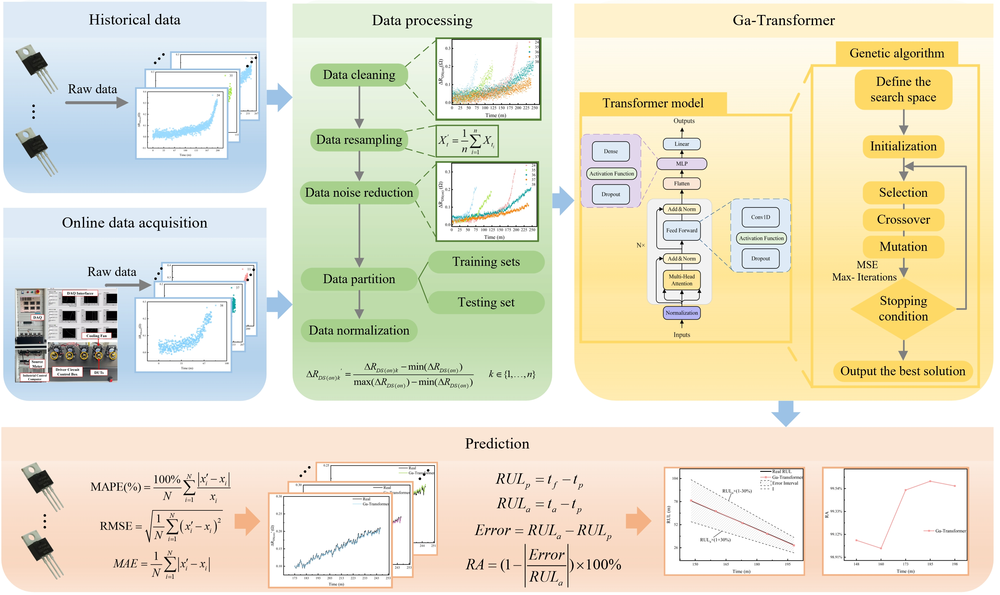

### Abstract 
Power switching devices serve as critical components in power conversion systems, making their lifespan evaluation essential for ensuring the safe and reliable operation of such systems. To address the limitations of existing statistical data-driven methods, which often exhibit low accuracy, poor stability, and inadequate adaptability in handling complex, nonlinear, and large-scale data, this study proposes a deep learning-based approach for estimating the remaining useful life (RUL) of these devices. The proposed method integrates the global search capabilities of a genetic algorithm to optimize model hyperparameters with the global attention mechanism of the Transformer model to construct a robust device lifespan prediction framework. Specifically, the study outlines a comprehensive framework for reliability prediction of power MOSFETs and validates the methodology using power cycling test results. The results demonstrate that the optimized model achieves an average absolute percentage error significantly lower than traditional particle filter models, improving prediction performance by a factor of 3 to 5.				

### Overview

Overview of remaining useful life prediction methodology employing Ga-Transformer approach.
